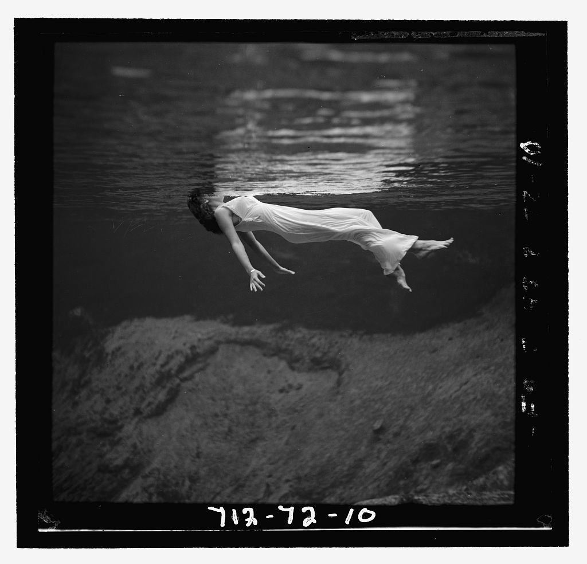

# 专辑

## From Left to Right｜1969—1970 年录音

1969 年秋至 1970 年春，Bill Evans 在纽约与旧金山进行多次录音，同时使用 Steinway 三角钢琴与 Fender Rhodes 电钢琴。Eddie Gómez、Marty Morell 组成节奏组，部分曲目另有 Sam Brown 的吉他与 Michael Leonard 编写、指挥的乐团。

这是 Evans 首次在一张专辑中系统使用 Fender Rhodes。《What Are You Doing the Rest of Your Life?》《I'm All Smiles》《Why Did I Choose You?》来自电影或舞台歌曲，《Soirée》由 Earl Zindars 作曲，《Children's Play Song》则由 Evans 作曲。

录音分散在 1969 年 10 月、11 月与 1970 年 3 月至 5 月。部分曲目经历过多次录音和叠录，现有唱片资料只能确认这段日期范围，已很难为每一首确定唯一的录音日。

## Kind of Blue｜1959 年哥伦比亚录音

1959 年 3 月 2 日与 4 月 22 日，Miles Davis 带着 Cannonball Adderley、John Coltrane、Bill Evans、Paul Chambers、Jimmy Cobb 走进纽约哥伦比亚 30 街录音室；Wynton Kelly 只在《Freddie Freeloader》中弹钢琴。第一天录下《So What》《Freddie Freeloader》《Blue in Green》，第二天完成《All Blues》《Flamenco Sketches》。

Davis 没有安排完整排练，只向乐手提供简短的调式、旋律草图与结构说明。Bill Evans 在原版内页中以日本水墨画作比，说明乐手首次面对材料并直接录音的方法。

《Blue in Green》的署名经历过变化：1959 年原版唱片只列 Miles Davis；Evans 后来的录音曾标为 Davis–Evans，Davis 遗产管理方也在后来的出版中承认 Evans 的共同作者身份。原版署名与后来的共同创作说法，因而需要同时保留。

## Time Out｜不规则拍号实验

*Time Out* 录于 1959 年 6 月 25 日、7 月 1 日和 8 月 18 日，地点是纽约哥伦比亚 30 街录音室。Dave Brubeck、Paul Desmond、Eugene Wright 与 Joe Morello 围绕拍号展开整张唱片，曲目使用了 9/8、5/4、6/4 等节拍组织。

部分节奏材料来自四重奏 1958 年的欧亚巡演。Brubeck 在土耳其听见街头音乐家把九拍分成 2+2+2+3，随后写成《Blue Rondo à la Turk》；Morello 的五拍鼓型促使他请 Desmond 写曲，后者提供两个旋律主题，Brubeck 将其组织为《Take Five》。《Take Five》后来成为四重奏销量最高的单曲。

逐曲录音分配为：8 月 18 日录《Blue Rondo à la Turk》《Pick Up Sticks》；7 月 1 日录《Strange Meadow Lark》《Take Five》；6 月 25 日录余下三首。原专辑六首由 Brubeck 作曲，《Take Five》由 Desmond 作曲。

## Undercurrent｜钢琴与吉他二重奏

1962 年 4 月 24 日与 5 月 14 日，Bill Evans 与 Jim Hall 在纽约 Sound Makers 录音室只用钢琴和吉他完成 *Undercurrent*。这既是两人首次以二重奏共同领衔，也是 Evans 在 Scott LaFaro 去世后的沉默期之后，重新以领衔者身份留下的重要录音之一。

唱片没有使用贝斯与鼓。《My Funny Valentine》采用快速演奏，《Skating in Central Park》改编自 John Lewis 的电影配乐。Hall 后来谈到自己的二重奏观念时说，希望“作曲在演奏中发生”，双方保持平等。

封面所用水下照片由 Toni Frissell 于 1947 年在佛罗里达 Weeki Wachee Spring 拍摄，画面中的模特是 Kay Jones。网站收录的六首中，《I Hear a Rhapsody》录于 4 月 24 日，其余曲目录于 5 月 14 日。

## Waltz for Debby｜Village Vanguard 现场

1961 年 6 月 25 日，Bill Evans、Scott LaFaro 与 Paul Motian 在纽约 Village Vanguard 从下午场演到晚间场。制作人 Orrin Keepnews 录下整天演出，后来从同一批母带编成 *Sunday at the Village Vanguard* 与 *Waltz for Debby* 两张唱片。前者的选曲较多突出 LaFaro 的作品，后者收录更多标准曲与 Evans 的题名曲。

十天后，LaFaro 在车祸中去世，年仅 25 岁。6 月 25 日的录音里，三位合作约一年半的乐手仍频繁交换声部功能：低音提琴参与旋律发展，鼓推动节奏变化，钢琴也在伴奏与独奏之间转换。

题名曲是 Evans 写给侄女 Debby 的圆舞曲，后来由 Gene Lees 填词。网站收录的七首全部来自 6 月 25 日的 Village Vanguard 演出；其中《Porgy》见于后续扩展版本，原始 LP 的标准曲序通常止于《Milestones》。

## You Must Believe in Spring｜1977 年三重奏录音

*You Must Believe in Spring* 录于 1977 年 8 月 23—25 日，地点是洛杉矶 Capitol Studios，由 Bill Evans、Eddie Gómez、Eliot Zigmund 组成三重奏，Helen Keane 与 Tommy LiPuma 制作。唱片到 1981 年、Evans 去世后才发行，因此常被置于他生命末期的叙事中；实际录音完成于 1977 年。

LiPuma 回忆，录音时三个人配合紧密，Evans 也认为专辑达到了预期状态。标题曲来自 Michel Legrand 为 1967 年电影 *The Young Girls of Rochefort* 写的旋律，英文歌词由 Alan 与 Marilyn Bergman 完成；《Theme from M*A*S*H》由 Johnny Mandel 作曲、Mike Altman 作词，是 LiPuma 建议 Evans 录制的曲目。

专辑后来的献辞与 Evans 家人的离世相关。录音完成于 1977 年，其兄 Harry 于 1979 年去世，相关纪念文字在发行阶段加入。

原始 LP 收录七首曲目。后来的 CD 与数字扩展版加入同批 1977 年录音中的《Without A Song》《Freddie Freeloader》与《All Of You》，网站按十首扩展版曲序收录。
