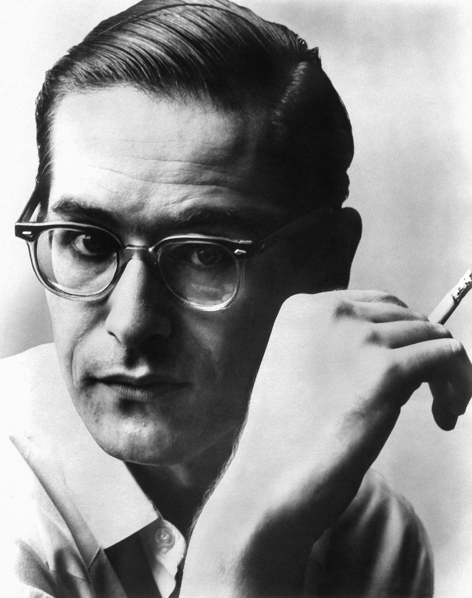
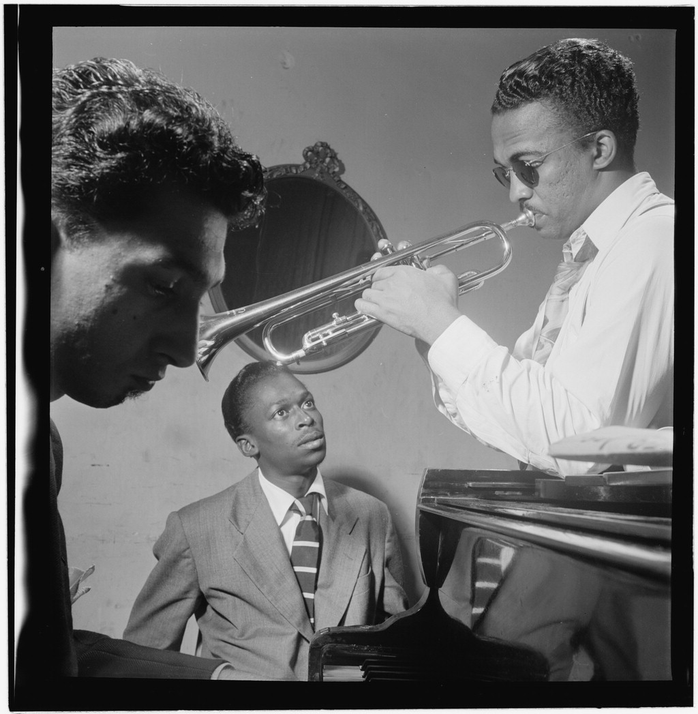
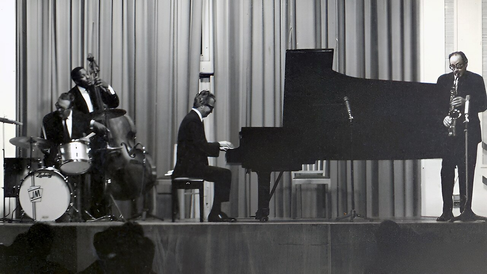
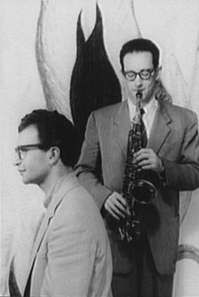
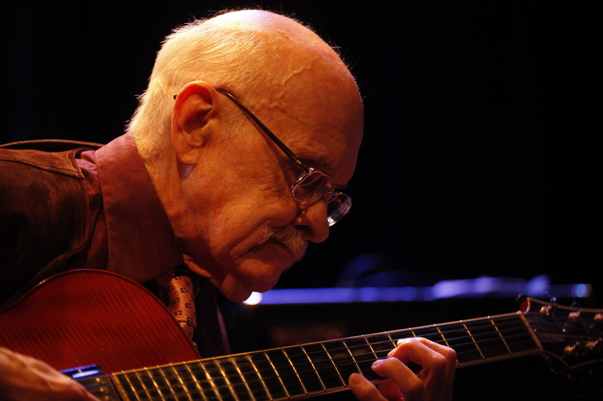

# 音乐家

## Bill Evans｜把和声写成呼吸的人

Bill Evans（William John Evans，1929—1980）生于新泽西州普莱恩菲尔德。童年所受的古典钢琴训练、大学时期的长笛与作曲学习，使他的爵士语汇从一开始便带着清澈的声部意识。服役归来后，他在 1955 年进入纽约职业乐坛；1958 年短暂加入 Miles Davis 乐队，随后参与 *Kind of Blue*，成为爵士乐由密集和弦向调式空间转身时最敏感的声音之一。

Evans 最重要的革新，并不是把钢琴独奏推得更响亮，而是重新安排三重奏里的“谁在说话”。与 Scott LaFaro、Paul Motian 组成的三重奏不再由钢琴发号施令：低音提琴可以提出旋律，鼓可以改变句子的重心，三个人像在同一张纸上即时写作。1961 年 Village Vanguard 的现场录音把这种平等对话保存下来，也因 LaFaro 十天后猝逝而带上无法回避的告别意味。

他的音乐常被形容为内省，却并非软弱。精密的配器感、对触键色彩的控制，以及宁愿留下空白也不草率填满的节制，构成了他的力量。晚年他仍持续巡演、录音；*You Must Believe in Spring* 的制作人 Tommy LiPuma 回忆，1977 年录音时三重奏几乎完全“锁在一起”，而 Evans 本人也认为成品准确抵达了目标。这里的平静，不是回避现实，而是把复杂情感整理成可以呼吸的秩序。

**馆藏关联**：*From Left to Right*、*Kind of Blue*（钢琴）、*Undercurrent*、*Waltz for Debby*、*You Must Believe in Spring*。

## Miles Davis｜总在下一扇门之前

Miles Davis（Miles Dewey Davis III，1926—1991）生于伊利诺伊州奥尔顿，在东圣路易斯长大。1944 年赴纽约进入茱莉亚学院后，他很快走进 Charlie Parker 身边的比博普现场；此后半个世纪，他几乎每隔数年便重新组织一次自己的声音：从 *Birth of the Cool* 的冷爵士配器，到五十年代末的调式实验，再到六十年代第二五重奏与七十年代的电子化语言。

他的号音并不追求持续炫技。弱音器后的细线、音与音之间的停顿、略带沙砾的攻击，都让一句旋律像从黑暗中被刻出来。*Kind of Blue* 的方法最能说明他的领导方式：录音前不进行完整排练，只给乐手调式、旋律片段和简要结构，让真正的决定在麦克风前发生。那不是毫无准备的偶然，而是把一群顶尖即兴者置于刚刚足够的框架中。

Davis 对过去始终保持警惕。他的职业生涯不是一条风格逐渐成熟的直线，更像不断离开已经成功的房间。也因此，理解 *Kind of Blue* 最好的方式不是把它当作“舒缓爵士”的定型，而是听见一位乐队领袖如何主动撤去旧有路标，让每个人第一次经过那片空间。

**馆藏关联**：*Kind of Blue*；另作曲的《Milestones》由 Bill Evans Trio 在 Village Vanguard 演奏。

## Dave Brubeck｜让时间拥有地理

Dave Brubeck（David Warren Brubeck，1920—2012）生于加州康科德，在牧场与母亲的钢琴课之间长大。他在太平洋学院改学音乐，后来从 Darius Milhaud 接受作曲训练；第二次世界大战期间，他组织过一支种族融合的军乐队。战后，古典复调、爵士律动以及对公共议题的敏感，渐渐在他的作品里汇成同一条河。

1951 年成立的 Dave Brubeck Quartet，以 Paul Desmond 的中音萨克斯为抒情轴心；Joe Morello 的节奏创造力与 Eugene Wright 的稳定脉搏，则让乐队能够把不规则拍号真正变成可摆动的音乐。1958 年美国国务院安排的欧亚巡演尤其关键：Brubeck 在土耳其听到街头乐手以 2+2+2+3 组织九拍节奏，又在旅途中接触多种节奏文化。回到纽约，这些经验没有被做成异国情调的明信片，而是成为 *Time Out* 的结构材料。

Brubeck 终生也写宗教音乐、清唱剧与大型作品，但公众记忆常停在《Take Five》。应当补上一句：那首曲子的主题出自 Desmond，Brubeck 负责把两个主题组织成完整曲式。真正属于他的成就，是让学院训练、旅行经验与四人即兴在同一张畅销唱片里自然共存。

**馆藏关联**：*Time Out*（除《Take Five》外六首均由他作曲）。

## Paul Desmond｜干马提尼一样的萨克斯

Paul Desmond（Paul Emil Breitenfeld，1924—1977）生于旧金山，是 Dave Brubeck Quartet 最易被一耳认出的声音。他曾用一个著名比喻描述自己的理想音色：像一杯“干马提尼”。这句话并非装饰——他的中音萨克斯确实回避尖锐的炫耀，以轻、冷、略带烟雾的线条在钢琴和声上游走。

他与 Brubeck 的关系建立在差异上：一个偏爱结构与复节奏，一个以旋律和反应速度见长。《Take Five》诞生时，Brubeck 希望为 Morello 已在舞台上探索的五拍鼓型写一首曲子；Desmond 带来两个主题，Brubeck 将其整理为最终结构。作品后来成为四重奏最广为人知的录音，Desmond 则把作曲版税遗赠给美国红十字会。

他不是一位大量写作的作曲家，却以音色证明“少”也可以是一套完整美学：不挤压乐句，不追逐最高音，不把机敏变成喧闹。*Time Out* 中，他总能让奇数拍听起来像自然步态，这正是整张唱片跨越实验与流行之间鸿沟的关键。

**馆藏关联**：*Time Out*；《Take Five》作曲者及全专辑中音萨克斯演奏者。

## Jim Hall｜让二重奏成为共同作曲

Jim Hall（James Stanley Hall，1930—2013）生于纽约州布法罗，在克利夫兰音乐学院学习作曲。五十年代中期随 Chico Hamilton 崭露头角，之后与 Jimmy Giuffre、Sonny Rollins、Ella Fitzgerald 等人合作。他的吉他声不以密集音符取胜：音量克制、和声敏锐，常把伴奏与独奏之间的边界轻轻抹去。

Hall 谈二重奏时说，他希望“作曲在演奏中发生”，两位乐手是相等的部分。1962 年与 Bill Evans 录制 *Undercurrent*，正是这种观念的早期典范。没有贝斯和鼓替他们划定地面，钢琴与吉他必须同时负责旋律、和声、呼吸和时间；两件乐器有时彼此补句，有时故意留下一个谁也不占有的空白。

这种平等也解释了为何 *Undercurrent* 不像“钢琴家加吉他伴奏”。在《My Funny Valentine》的快速交锋中，Hall 能像鼓手般切分；在《Skating in Central Park》里，他又让单音线条与 Evans 的和弦保持若即若离。多年以后，他仍把聆听视为即兴的核心：作品不是写好后被执行，而是在两个人真正听见彼此时继续生长。

**馆藏关联**：*Undercurrent* 的共同领衔演奏者；《Romain》作曲者。

---

照片作者、许可与人物资料来源见 [来源与图片授权](sources.md)。
